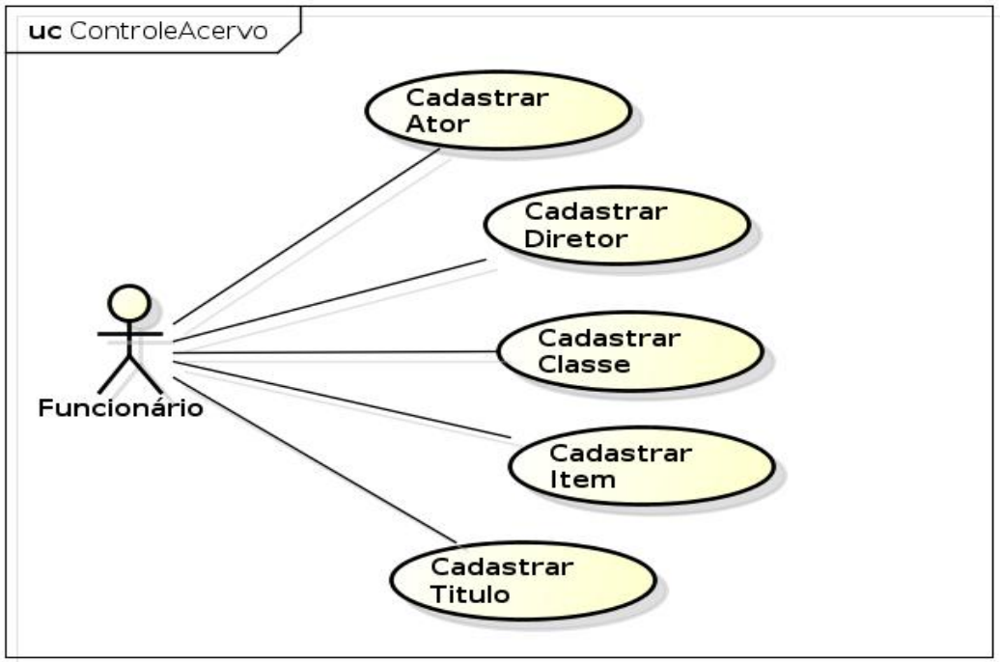
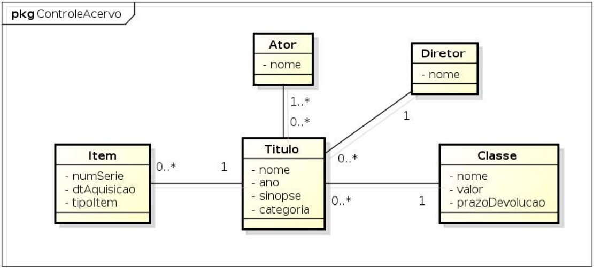

# Pessoal e contato

**Nome:** Luiz Gustavo Gomes Damasceno. 
**Profissão:** Software Engineer. 
**E-mail:** [lgustavogomdam@gmail.com](mailto:lgustavogomdam@gmail.com?subject=Contato+projeto+angular+%22app-video-locadora%22&body=Ol%C3%A1+LGustavo,+vi+seu+projeto+angular+e+me+gerou+interesse...). 
**LinkedIn:** [@lgustavogomdam](https://www.linkedin.com/in/lgustavogomdam/). 
**Telefone / WhatsApp:** +55 27 9 9870-4980

## Angular App Video-Locadora

Este projeto foi gerado com [Angular CLI](https://github.com/angular/angular-cli) versão 17.0.3.

Ele conta com o uso do repositório backend: [api-video-locadora](https://github.com/lgustavogomdam/api-video-locadora)

### Sobre o sistema

  O webapp é um sistema para C.R.U.D. de Atores, Diretores, Classes, Titulos e Item para uma suposta video-locadora de estudo de caso.

### Start

Inicie a execução do projeto com `npm install` para baixar todas as dependencias do JS para que tudo funcione perfeitamente.

Execute o comando `npm start` para "rodar" o projeto.

Navegue até `http://localhost:4200/` para ver a aplicação funcionando.

### Diagrama de caso de uso

### Diagrama de classes

